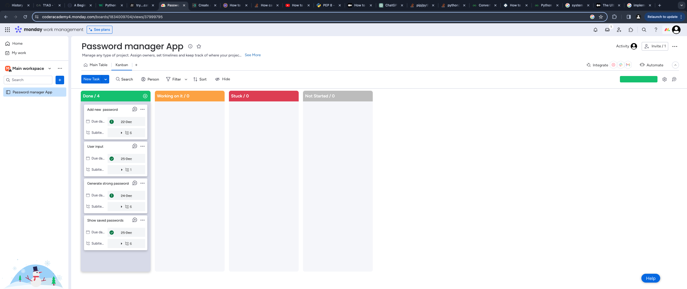

# Password Manager 
  

# Introduction:

Password manager is a simple terminal aplication written in python, it was built to asisst you to remember everithing you cant.
In this day and age with all the different web services we use is hard to keep track and remember all of our passwords, thats why you need ***Password Manager*** to assist you.
Store passwords for a service, check your stored passwords or generate a strong one.    

# R4 Source controll repository:
* Link to my  [GitHub Repository](https://github.com/poysongnocchi/Password-Manager).

* Link to my [Video presentation](https://www.canva.com/design/DAF3-XOlqho/S40so7ylk-fuODA1Sk3dkQ/view?utm_content=DAF3-XOlqho&utm_campaign=designshare&utm_medium=link&utm_source=recording_view).    

# R5 Code style guide:

The code style guide the application will adhere to is:
PEP 8 – Style Guide for Python Code
Author:
Guido van Rossum <guido at python.org>, Barry Warsaw <barry at python.org>, Alyssa Coghlan <ncoghlan at gmail.com>
Status:
Active
Type:
Process
Created:
05-Jul-2001
Post-History:
05-Jul-2001, 01-Aug-2013

* Link to the [table of content](https://peps.python.org/pep-0008/)
  

Reference:

van Rossum, G., Warsaw, B. and Coghlan, N. (2001). PEP 8 – Style Guide for Python Code | peps.python.org. [online] peps.python.org. Available at: https://peps.python.org/pep-0008/.    

# R6 Application features:

**The application contains 3 main features:**
* **Show saved passwords:** It allows the user to view previously stored passwords displayed as a set of strings E.g. (service: Gmail, username: Person@Gmail.com, password: password1234)  
* **Add new password:** It allows the user to add passwords and usernames related to a specific service, data is stored as a list and can be accessed at a later date trough the feature ***Show saved passwords***   
* **Generate strong password:** This option generates a random password with a fixed lenght of 16 characters mixing uppercase with lowercase letters and a set of special characters. The random password generated is automatically copied to the clipboard and ready to be pasted  

**Optional personal modifications:** 
The lenght of the password generated can be changed by adjustig the < range( , ) > lenght  in the generate_password function as is seen bellow:   
~~~
def generate_password():
    random_password = "" 
    for i in range(0,12):      #CHANGE RANGE FOR CUSTOM LENGHT
        random_password += get_random_char() 
    
    for i in range(0,4):       #CHANGE RANGE FOR CUSTOM LENGHT
        random_password += get_random_special_char() 
       
    print(random_password)          
    pyperclip.copy(random_password) 
    print(Fore.CYAN + "Your password has been copied to the clipboard ")

~~~

# R8 Requirements:
* After dowloading the source code you need to make sure that you have python3 installed and the lybraries of  pyfiglet and colorama are installed correctly to guarantee the apropriate running of the aplication, you can do so by running the following commands in terminal:

~~~
pip install colorama
~~~ 

 

~~~
pip install pyfiglet
~~~
 

substitute with ***'pip3'*** if you have python 3 installed

**Hardware and system requirements:** Have python3 installed, Operating system: Linux- Ubuntu 16.04 to 17.10, or Windows 7 to 10, with 2GB RAM (4GB preferable)

**Command line arguments:** No command line arguments are neccessary to run the aplication other than user input to interact with the aplication

**Turn file into executable:** You can choose to run this file as an executable:

Install PyInstaller:
Open your terminal or command prompt and install PyInstaller using pip:

~~~
pip install pyinstaller
~~~
Navigate to your script's directory:
Open a terminal or command prompt and navigate to the directory where your Python script is located.

Create the executable:
Run the following command to create an executable:

~~~
pyinstaller --onefile your_script.py
~~~
Replace your_script.py with the name of your Python script.

The --onefile option bundles everything into a single executable file. You can omit this option if you prefer to have a directory with multiple files instead.

Find the executable:
PyInstaller will create a dist directory in your script's directory. Inside dist, you will find the executable file with the same name as your script (or a single executable file if you used --onefile).

# R7 Implementation plan

The aplication allows the user to utilize 3 main features: Add and store passwords, display previously stored passwords and creater randlomly generated passwords so the implementation plan was divided into 3 diferent checklists, each one of those was sub-divided into 6 requirements which are the same for each feature of the app.

**Add new password:**
* Write pseudocode 
* Verify that the code of the feature is duable and possible
* Write functions and code for the feature
* Test and handle possible errors
* Clean and optimize code
* Style feature where aplicable

**Show saved passwords:**
* Write pseudocode 
* Verify that the code of the feature is duable and possible
* Write functions and code for the feature
* Test and handle possible errors
* Clean and optimize code
* Style feature where aplicable

**Generate strong password:**
* Write pseudocode 
* Verify that the code of the feature is duable and possible
* Write functions and code for the feature
* Test and handle possible errors
* Clean and optimize code
* Style feature where aplicable

The final part of the implementation plan was to join toghether each function used for each feature of the aplication and test the general smooth operation of the aplication.
"Monday" was the project managment platform of choice for the development of this aplication; 20 different task were created, 6 for each feature and 2 for general operation of the platform E.g "Generate strong password/Write pseudocode", where "Generate strong password" rapresents the feature and "Write pseudocode" represents one of the subrequirements.
Each element of the checklist was marked as "Done", "Working on it", "Stuck" or "Not started" based on the situation of the task at a given time, screenshots as follow:

